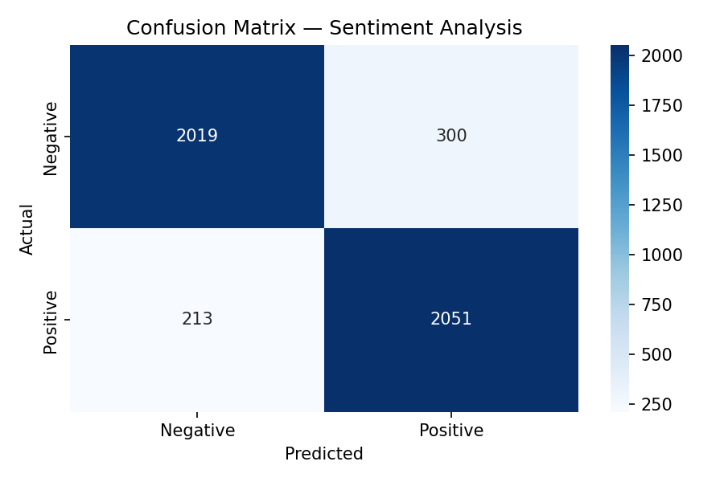

# Sentiment Analysis — IMDB Movie Reviews

TF-IDF + Logistic Regression pipeline achieving **88.8% accuracy** on 22,912 labeled reviews.

## Results
| Metric | Score |
|--------|-------|
| Accuracy | 88.8% |
| F1-Score | 0.89 (both classes) |
| Train / Test split | 18,329 / 4,583 samples |

## Tech Stack
`Python` `Scikit-Learn` `TF-IDF` `Pandas` `Matplotlib` `Seaborn`

## How It Works
1. Raw IMDB reviews cleaned using regex
2. Text vectorized with TF-IDF (10,000 features)
3. Logistic Regression trained on 80% of data, tested on 20%

## Sample Output
```
Enter a sentence: I love this movie
Sentiment: Positive (confidence: 92.3%)
```

## Confusion Matrix


## Dataset
[IMDB Movie Reviews — Kaggle](https://www.kaggle.com/datasets/lakshmi25npathi/imdb-dataset-of-50k-movie-reviews)
